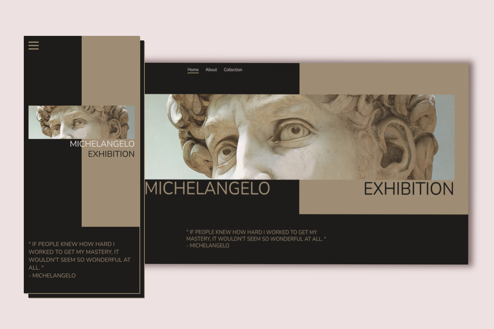

 

  
  <h1 align="center">Michelangelo Exhibition</h1>
  

## About The Project

The idea was to create a website dedicated to the Michelangelo exhibition. The project includes his biography and art collection.

### Build With

- [Next.js](https://nextjs.org/)
- [TypeScript](https://www.typescriptlang.org/)
- [TailwindCSS](https://tailwindcss.com/)
- [Redux Toolkit](https://redux-toolkit.js.org/)
- [Framer-Motion](https://www.framer.com/motion/)
